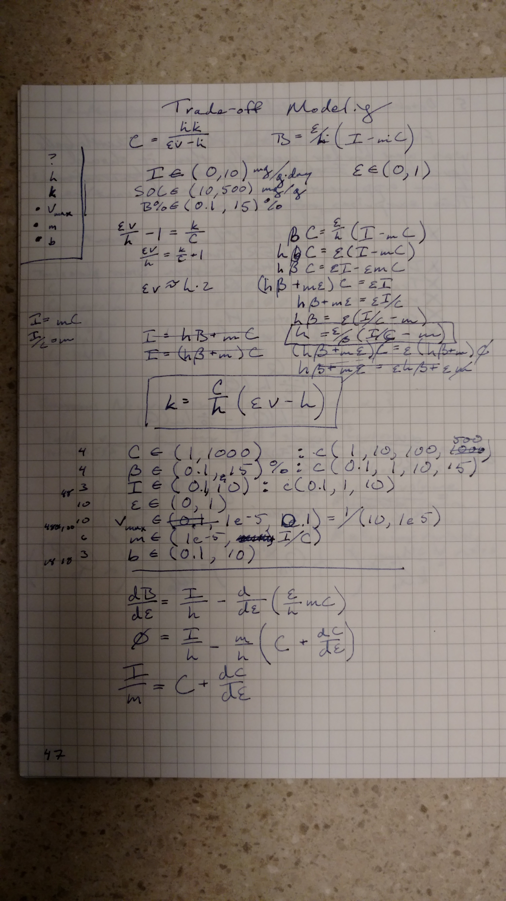
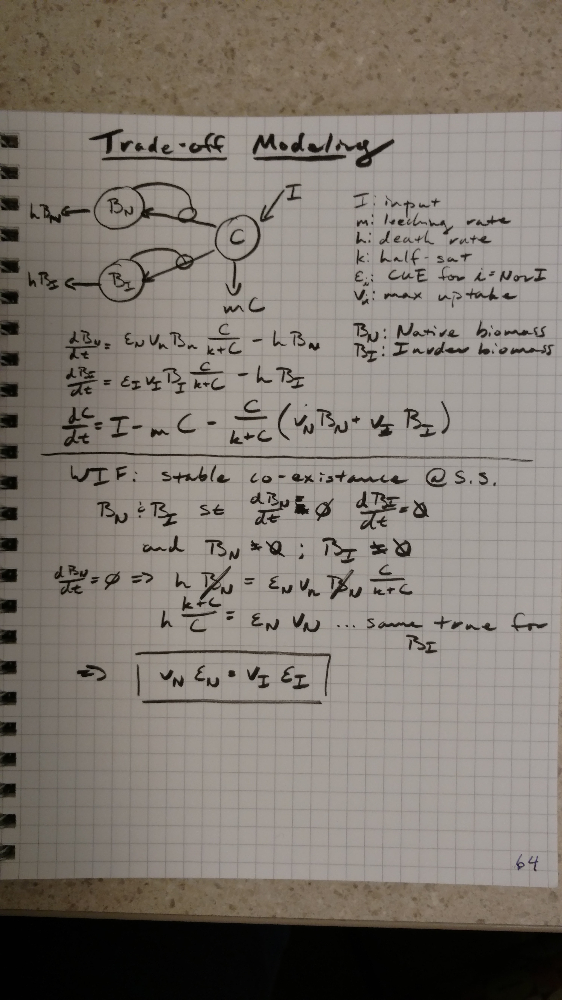

#Basic model description
```{r modelPic, out.width='30%', echo=FALSE}
library(knitr)
include_graphics('notes/2016September_meeting.jpg')
```

#Target parameters to hit carbon targets
```{r parmPic, out.width='30%', echo=FALSE}
library(knitr)

```

#Competition model with co-existance derivation
```{r coExPic, out.width='30%', echo=FALSE}
library(knitr)

```

#Analysis code

##Set up
```{r setup}
library(assertthat)
library(reshape2)
library(ggplot2)
library(plyr)
library(rootSolve)
library(deSolve)
library(knitr)
library(cowplot)

sourceFiles <- 'R/invasion.R'
l_ply(sourceFiles, source)
```

##Visualize trade-off between cue and v
```{r tradeoff}
cue_v_tradeoff <- function(b, vmax, cue){
  return(vmax*(exp(-b*cue)-exp(-b))/(exp(0)-exp(-b)))
}

tradeoff.df <- adply(.data=c(0.1*1:9, 1:10), .margins=c(1), .id=c('id'), .fun=function(b){
  ans <- data.frame(b=b, cue=seq(0, 1, length=1000))
  ans$v <- cue_v_tradeoff(b=b, vmax=2, cue=ans$cue)
  return(ans)
})

ggplot(tradeoff.df) +geom_line(aes(x=cue, y=v, color=b))
```

##Find strategic CUE
```{r stratCUE}
tradeoff.df <- adply(.data=c(0.1,1,10), .margins=c(1), .id=c('id'), .fun=function(b){
  ans <- data.frame(b=b, cue=seq(0, 1, length=1000))
  ans$v <- cue_v_tradeoff(b=b, vmax=2, cue=ans$cue)
  return(ans)
})
strategic_cue <- ddply(tradeoff.df, c('b'), summarize, cue=cue[which.max(cue*v)])

co_cue <- ddply(tradeoff.df, c('b'), function(xx){
  temp_cue <- strategic_cue[strategic_cue$b == xx$b[1], 'cue']
  low <- subset(xx, cue < temp_cue)
  high <- subset(xx, cue > temp_cue)
  return(ddply(low, c('cue'), function(yy){
    ans <- data.frame(yy, 
                      cue.pair=high[which.min(abs(high$cue*high$v-yy$cue*yy$v)),'cue'],
                      v.pair=high[which.min(abs(high$cue*high$v-yy$cue*yy$v)),'v'])
  }))
})

temp <- ddply(co_cue, c('b'), function(xx){
  return(xx[sample.int(dim(xx)[1], size=1),])
})
 ggplot(tradeoff.df) +geom_point(aes(x=cue, y=cue*v, color=as.factor(b))) + 
   #geom_vline(data=strategic_cue, aes(xintercept=cue, color=as.factor(b))) +
   geom_vline(data=temp, aes(xintercept=cue, color=as.factor(b)), linetype='dotted') +
   geom_vline(data=temp, aes(xintercept=cue.pair, color=as.factor(b)), linetype='dotted') +
   geom_hline(data=temp, aes(yintercept=cue*v, color=as.factor(b)), linetype='dotted') +
   labs(title='CUE with same CUE*v values can co-exist')

ggplot(co_cue) + geom_line(aes(x=cue, y=cue.pair, color=as.factor(b))) + 
  geom_line(aes(x=cue.pair, y=cue, color=as.factor(b))) +
  geom_point(data=strategic_cue, aes(x=cue, y=cue, color=as.factor(b))) +
  geom_abline(slope=1, intercept=0) + labs(title='Co-existance lines for two populations',
                                           y='Population 1 [carbon use effiency]',
                                           x='Population 2 [carbon use effiency]')

```

#Pull target parameters
First let's try to calculate reasonable loss and uptake rates for the input (0.1 to 10 mg/g/day), soil carbon stock targets (SOC between 10 and 500 mg/g) and biomass (1 to 15 %) for one population.


```{r pullTargets}

##Input between 0.1 to 10 mg/g*day
##SOC (B+C) between 10 to 500 mg/g
##B:SOC between 0.001 to 0.15

##for inputs to match outputs at (10, 500)/tau_exit=(0.1, 10)
##tau_exit = (1, 5000) which now constrains 1/m and 1/h
##k should be order of mag around (10, 500)

#h: death rate
#k: half-sat of Monod growth
#I: input rate
#m: leach rate of substrate pool

ncuts <- 100
parm.df <- list(I=c(0.1, 1, 10), #input
                C=c(10, 50, 100, 500), #SOC
                B_rel=c(0.1, 1, 5, 15)/100, #biomass percent of total SOC = B+C
                b=c(0.1, 1, 10), #trade-off decay
                cue=seq(0.01, 0.99, length=ncuts), #carbon use effiency
                m_rel=c(0.01, 0.1, 0.5, 0.99), #loss rate relative to system input
                vmax_rel=c(1.1, 5, 10, 50, 100)) #maximum uptake for trade-off relative loss

parm.df$B_rel <- parm.df$B_rel/(1-parm.df$B_rel) #biomass as percentage of C

steady.state <- expand.grid(parm.df)
steady.state$m <- with(steady.state, I/C*m_rel) #set C loss rate relative to input rate
steady.state$B <- with(steady.state, B_rel*C) #set biomass relative to C

steady.state$h <- with(steady.state, cue/B_rel*(I/C-m)) ##set from target parm analysis
steady.state$vmax <- with(steady.state, h/cue*vmax_rel) #set vmax
steady.state$v <- with(steady.state, cue_v_tradeoff(b, vmax, cue)) #calc v from tradeoff
steady.state$k <- with(steady.state, C/h*(cue*v-h)) ##set from target parm analysis

##recalculate strategic CUE from new parmaeter set
strategic_cue <- ddply(steady.state, c('b'), summarize, cue=cue[which.max(cue*v)])

##get bounds for target
quantPar <- apply(subset(steady.state, k>0), 2, quantile, na.rm=TRUE)
kable(quantPar)
```

Then use those targets to generate parameters and solve for the 'best' cue numerically.
```{r bestCUE, cache=TRUE}
ncuts <- 50
parm.df <- list(I=c(0.1*(1:9), 1:10), 
                cue=seq(0.01, 0.99, length=ncuts),
                m = exp(seq(log(quantPar['25%', 'm']), log(quantPar['75%', 'm']), length=5)),
                h = exp(seq(log(quantPar['25%', 'h']), log(quantPar['75%', 'h']), length=10)),
                k = exp(seq(log(quantPar['25%', 'k']), log(quantPar['75%', 'k']), length=5)),
                b=c(0.1, 1, 10),
                vmax=exp(seq(log(quantPar['25%', 'vmax']), log(quantPar['75%', 'vmax']), length=5)))
          
steady.state <- expand.grid(parm.df)
steady.state$v <- with(steady.state, cue_v_tradeoff(b, vmax, cue))
steady.state$C <- with(steady.state, h*k/(cue*v-h))
steady.state$B <- with(steady.state, cue/h*(I-m*C))

strategic_cue <- ddply(steady.state, c('b'), summarize, cue=cue[which.max(cue*v)])

realisticSOC <- subset(steady.state, B/(B+C) < 0.15 & B/(B+C) > 0.01 & B+C > 10 & B+C < 500 & B >0 & C > 0)
uniquePars <- unique(subset(realisticSOC, select=c('I', 'm', 'h', 'k', 'b', 'vmax')))
cueCount <- ddply(realisticSOC, c('I', 'm', 'h', 'k', 'b', 'vmax'),
                  function(xx){
                    ans <- data.frame(validCUE.min = min(xx$cue),
                                      validCUE.max = max(xx$cue),
                                      numValidCUE=length(xx$cue))
                    return(ans)})
cueCount <- cueCount[order(cueCount$numValidCUE, decreasing=TRUE),]
cueCount$validIndex <- 1:(dim(cueCount)[1])

steady.state <- merge(steady.state, cueCount, all.x=TRUE)

bestCUE <- ddply(subset(steady.state, is.finite(validIndex) & C > 0 & B > 0), c('validIndex'), function(xx){
  ans <- xx[which.max(xx$B),]
  return(ans)
})

bestCUE <- merge(bestCUE, strategic_cue, by=c('b'), suffixes=c('', '.strategic'))
bestCUE <- bestCUE[order(bestCUE$validIndex),]

kable(head(bestCUE))
kable(summary(bestCUE))
```

#Numerical validate strategic CUE with 100 yr invasion model
Pick several parameter sets which generated 'valid' soil carbon pools for a broad range of cue values (ie high numValidCUE). And explore the invasion consiquences across a wide range of cue (and thus vmax) values for both the native and invation population. Compare this to the previously calculated stategic cue values.
```{r invade, cache=TRUE}

ggplot(subset(steady.state, validIndex %in% 1:9)) + 
  geom_line(aes(x=cue, y=B, group=validIndex)) + 
  labs(title='Steady state biomass across cue for diff. par. sets')

invaded <- dlply(subset(bestCUE, validIndex %in% 1:9), c('validIndex'), function(native){
  #native <- subset(bestCUE, validIndex == 4)
  #print(native)
  cueRange <- range(subset(steady.state, validIndex == native$validIndex & 
                             B/(B+C) < 0.15 & B/(B+C) > 0.01 & 
                             B+C > 10 & B+C < 500 & B >0 & C > 0, select='cue'))
  
  
  invasion_100yr <- adply(1:1e2, 1, function(ii){
    parm <- as.list(subset(native, select=-C:-B))
    parm$index <- sprintf('broad.%d', ii)
    
    parm$cue1 <- runif(1, max=max(cueRange), min=min(cueRange))
    parm$cue2 <- parm$cue1+rnorm(1,mean=0, sd=0.05)
    ans <- invasion(parm=parm, tradeoff=cue_v_tradeoff)
    
    parm$index <- sprintf('narrow.%d', ii)
    parm$cue1 <- rnorm(1, mean=native$cue.strategic, sd=0.05)
    parm$cue2 <- parm$cue1+rnorm(1,mean=0, sd=0.05)
    ans <- rbind.fill(ans, invasion(parm=parm, tradeoff=cue_v_tradeoff))
    return(ans)
  })
  
  winner.pl <- ggplot(invasion_100yr) + 
    geom_point(aes(x=cue1, y=cue2, color=B1/(B1+B2))) + 
    geom_vline(data=native, aes(xintercept=cue), color='red') + 
    geom_vline(data=native, aes(xintercept=cue.strategic), color='orange') +
    labs(title=sprintf('Valid Index: %d', native$validIndex), x='Native CUE (B1)',
         y='Invader CUE (B2)')
  
  return(winner.pl)
})

kable(subset(bestCUE, validIndex %in% 1:9))
plot_grid(plotlist=invaded, ncol=3)
```
Figure capture: The red line is the optimal CUE without competition. The orange line is the stategic CUE with competition. Blue dots represent the relative percentatve of the native population (B1) at the end of 100 years.

#Examin effects of input on optimal CUE
```{r}
I_cue_index <- unique(bestCUE[, c('b', 'm', 'h', 'k', 'vmax')])
I_cue_index$I_cue_index <- 1:(dim(I_cue_index)[1])
temp <- merge(subset(I_cue_index,I_cue_index %in% sample(length(I_cue_index), 50)), bestCUE)

ggplot(temp) + 
  geom_point(aes(x=I, y=cue)) +
  geom_line(aes(x=I, y=cue, group=I_cue_index)) +
  labs(y='Optimal CUE', I='Input')
```

#Helper files
```{r helpers, comment=''}
l_ply(sourceFiles, function(xx){cat(readLines(xx), sep='\n')})
```
