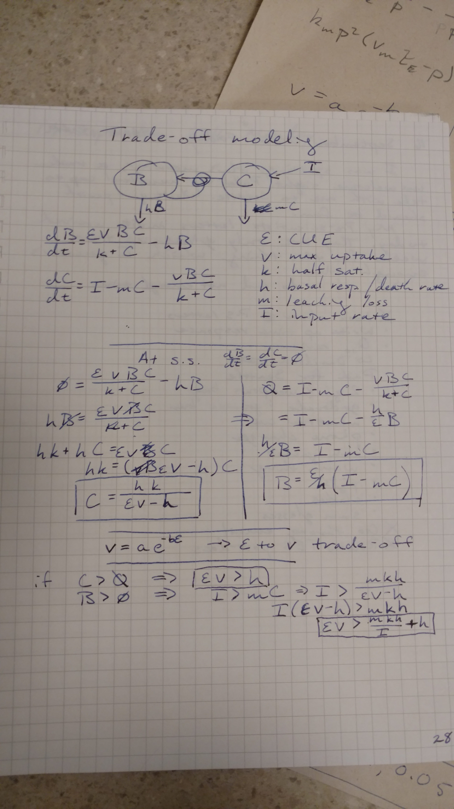
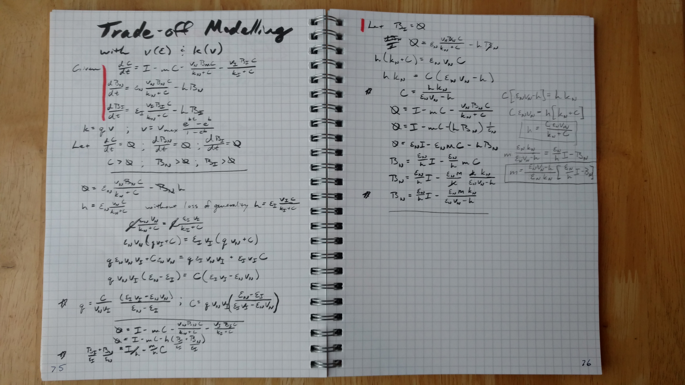

##Set up
```{r setup, message=FALSE}
library(assertthat)
library(reshape2)
library(ggplot2)
library(GGally)
library(plyr)
library(rootSolve)
library(deSolve)
library(knitr)
library(pander)
library(cowplot)

#sourceFiles <- 'R/invasion.R'
#l_ply(sourceFiles, source)

set.seed(100) #reproducible random selection

sessionInfo()
```

#Basic model description
The goal of this model to simulation biologically mediated decomposition. There are two main pools, Substrate ($C$) and Biomass ($B$). Carbon is added to the substrate pool via inputs ($I$), leached from both pools at a rate proportional to the carbon in the pool ($h$ fraction of the biomass pool $B$, and $m$ fraction of the substate pool $C$), and transfer between the substrate $C$ pool and biomass $B$ pool via a Monod uptake with a maximum rate $v_{max}$, half-saturation constant $k$, and carbon use effiency $\epsilon_{cue}$.

$\frac{dB}{dt}=\frac{\epsilon_{cue}vBC}{k+C}-hB$

$\frac{dC}{dt}=I-mC-\frac{vBC}{k+C}$

At steady state ($\frac{dB}{dt}=\frac{dC}{dt}=0$) this implies that:

$B=\frac{\epsilon h}{I-mC}$

$C=\frac{hk}{\epsilon v-h}$

##Calculate the leaching and turnover rate
Assume that the input rate, biomass, and carbon pools are given targets, and that we are exploring cue, v, and k. We can thus define the leaching and turnover rates at steady state:

```{r findDecay}
find_h <- function(C, cue, v, k){
  return(C*cue*v/(k+C))
}

find_m <- function(cue, v, h, k, I, B){
  return((cue*v-h)/(cue*k)*(cue/h*I-B))
}
```

```{r modelPic, out.width='30%', echo=FALSE}
library(knitr)

```

If we further assume that there is a trade off between both 1) uptake $v$ and carbon use effiency ($\epsilon$) such that $v=\frac{e^{b\epsilon_cue}-e^b}{1-e^b}$ and the half saturation constant ($k$) such that $k=a v +k_{min} = \frac{a}{1-e^b}(e^{b\epsilon_cue}-e^b)$. Defined as:

##Visualize trade-off between cue vs uptake and k
```{r tradeoff_cue_v}
cue_v_tradeoff <- function(b, vmax, cue){
  return(vmax*(exp(b*cue)-exp(b))/(exp(0)-exp(b)))
}

tradeoff.df <- adply(.data=c(-0.1*1:9, -1*1:10, 0.1*1:9, 1:10), .margins=c(1), .id=c('id'), .fun=function(b){
  ans <- data.frame(b=b, cue=seq(0, 1, length=1000))
  ans$v <- cue_v_tradeoff(b=b, vmax=2, cue=ans$cue)
  return(ans)
})

ggplot(tradeoff.df) + geom_line(aes(x=cue, y=v, group=b, color=b))

v_k_tradeoff <- function(kmin, k_v_slope, v){
  return(kmin+k_v_slope*v)
}

tradeoff.df$k <- v_k_tradeoff(kmin=0, k_v_slope=100/2, tradeoff.df$v) #slope is max SOC over vmax range
```

This leads to the following steady state calculations for one biomass pool:

```{r ssOneB}
steadyState <- function(b, vmax, kmin, k_v_slope, h, m, I, cue){
  v <- cue_v_tradeoff(b=b, vmax=vmax, cue)
  k <- v_k_tradeoff(kmin=kmin, k_v_slope=k_v_slope, v=v)
  
  C <- h*k/(cue*v-h)
  B <- cue/h*(I-m*C)
  return(list(B=B, C=C))
}
```
#Optimum carbon use effiency
We want the optimum carbon use effiency where biomass is maximum as steady state but that is not possible to solve analytically (you end up with $y=xe^x$, solve for x).

```{r findOptCUE}
optimum_cue <- function(b, vmax, kmin, k_v_slope, h, m, I){
  cue <- seq(0, 1, length=100)
  ans <- steadyState(b, vmax, kmin, k_v_slope, h, m, I, cue)
  ans$B[ans$B <= 0 | ans$C <= 0] <- -Inf
  
  best <- which.max(ans$B)
  return(list(B=ans$B[best], C=ans$C[best], cue=cue[best]))
}
```

##Generate reasonable parameter sets without compitition
Given that we have input targets between 0.1 and 10 mg-C per g-soil per day, total carbon pools of between 10 to 500 mg-C per g-soil, and a biomass to total carbon ratio of between 0.1 and 15 percent. Let's generate some reasonable parameters to draw on.

```{r resonable, cache=TRUE}
parm.ls <- list(b=c(-10, -1, -0.1, 0.1, 1, 10),
                vmax=c(0.1, 0.5, 1, 5, 10, 100),
                kmin=c(0, 1, 10, 100, 1000),
                k_v_slope=c(1/10, 1, 10, 100, 1000),
                h=c(1e-4, 1e-3, 1e-2, 0.1, 1, 10),
                m=c(1e-4, 1e-3, 1e-2, 0.1, 1, 10),
                I=c(0.1, 1, 10))

optParm.df <- expand.grid(parm.ls)

optParm.df <- ddply(optParm.df, names(optParm.df), function(xx){
  ans <- as.data.frame(optimum_cue(b=xx$b, vmax=xx$vmax, kmin=xx$kmin, k_v_slope=xx$k_v_slope, 
              h=xx$h, m=xx$m, I=xx$I))
  return(ans)
})

optParm.df$OnTarget <- with(optParm.df, B+C > 10 & B+C < 500 & B/(B+C)> 0.001 & B/(B+C) < 0.15)

#parm.allI <- ddply(subset(optParm.df, OnTarget), setdiff(names(parm.ls), 'I'), summarize, 
#                 numI=length(I), minI=min(I), maxI=max(I))
#ggpairs(subset(optParm.df[,c(names(parm.ls), 'OnTarget')]) 

ggplot(subset(optParm.df, OnTarget)) + geom_histogram(aes(x=cue))
ggplot(subset(optParm.df, OnTarget)) + geom_violin(aes(x=as.factor(I), y=cue)) 
#ggplot(subset(optParm.df, OnTarget)) + geom_jitter(aes(x=I, y=B+C)) + scale_x_log10()

```

#Competition model co-existance
Consider the senerio where the native popuation is invated by a second competiting population that has a different carbon use effiency but is otherwise equivalent.
Let the strategic carbon use effiency be where the native popuation is never invadable no matter what carbon use effiency value the invader has.

```{r coExPic, out.width='60%', echo=FALSE}
library(knitr)

```

In otherwords both popuations are stable where one is either 0 or
$\frac{\epsilon_n v_n}{k_n + C} = \frac{\epsilon_i v_i}{k_i + C}$
where $n$ and $i$ stand for the native and invading populations respectively.

Again, not solvable analytically given our trade-off function but numerically we can calculate the following:
```{r findStrategic, cache=TRUE}
strategic_cueI <- function(b, vmax, kmin, k_v_slope, m, h, I){
  cue <- seq(0, 1, length=100)
  v <- cue_v_tradeoff(b=b, vmax=vmax, cue)
  k <- v_k_tradeoff(kmin=kmin, k_v_slope=k_v_slope, v=v)
  
  ans <- steadyState(b, vmax, kmin, k_v_slope, h, m, I, cue)
  
  measure <- cue*v/(k+ans$C)
  measure[measure <= 0] <- NA
  flag <- which.max(measure)
  
  return(list(cue_strat=cue[flag], C_strat=ans$C[flag], B_strat=ans$B[flag]))
}

stratParm.df <- optParm.df
stratParm.df <- rename(stratParm.df, c('cue'='cue_opt', 'B'='B_opt', 'C'='C_opt', 'OnTarget'='validPools_opt'))
stratParm.df <- ddply(stratParm.df, names(stratParm.df), function(xx){
  return(as.data.frame(strategic_cueI(b=xx$b, vmax=xx$vmax, kmin=xx$kmin, 
                        k_v_slope=xx$k_v_slope, m=xx$m, h=xx$h, I=xx$I)))
})

stratParm.df$validPools_strat <- with(stratParm.df, B_strat+C_strat > 10 & 
                                        B_strat+C_strat < 500 & 
                                        B_strat/(B_strat+C_strat)> 0.001 & 
                                        B_strat/(B_strat+C_strat) < 0.15)
stratParm.df$orderDiff_mh <- round(log(stratParm.df$m)-log(stratParm.df$h), 1)
ggplot(subset(stratParm.df, validPools_opt & validPools_strat)) + 
  geom_point(aes(x=cue_opt, y=cue_strat)) + 
  geom_abline(slope=1, intercept=c(0), color='grey') +
  labs(x='Optimum CUE (max B w/o compition)', y='Strategic CUE (resistant to invasion)')
#test.parm <- as.list(stratParm.df[1,])
#attach(test.parm)
#detach(test.parm)
```

#Explore drivers of strategic and optimum differences
```{r exploreDifference}
diff.df <- subset(stratParm.df, validPools_opt & validPools_strat, 
                  select=setdiff(names(stratParm.df), c('orderDiff_mh')))

diff.df <- melt(diff.df, measure.vars=names(parm.ls))

ggplot(diff.df) + geom_violin(aes(x=as.factor(value), y=(cue_opt-cue_strat)/cue_opt)) + 
    facet_wrap(~variable, scale='free')
```

We are particullary interested in differences in inputs
```{r exploreInput, cache=TRUE}
validParms <- subset(stratParm.df, validPools_strat & validPools_opt)
I.arr <- seq(0.1, 10, by=0.3)
Igrad <- ddply(unique(validParms[,c("b", "vmax", "kmin", "k_v_slope", "h", "m")]), 
               c("b", "vmax", "kmin", "k_v_slope", "h", "m"), function(xx){
                 ans1 <- data.frame()
                 for(I in I.arr){
                   opt_results <- optimum_cue(xx$b, xx$vmax, xx$kmin, 
                                              xx$k_v_slope, xx$h, xx$m, I)
                   names(opt_results) <- paste(names(opt_results), '_opt', sep='')
                   strat_results <- strategic_cueI(xx$b, xx$vmax, xx$kmin, 
                                                   xx$k_v_slope, xx$m, xx$h, I)
                   ans1 <- rbind.fill(ans1, 
                                      as.data.frame(c(xx[c("b", "vmax", "kmin", 
                                                           "k_v_slope", "h", "m")], 
                                                      I=I, opt_results, strat_results)))
                   
                 }
                 #cat('dim ans1:', dim(ans1), '\n')
                 ans2 <- data.frame()
                 for(I in I.arr*rnorm(length(I.arr), mean=1, sd=0.05)){
                   opt_results <- optimum_cue(xx$b, xx$vmax, xx$kmin, xx$k_v_slope, 
                                              xx$h, xx$m, I)
                   names(opt_results) <- paste(names(opt_results), '_opt', sep='')
                   strat_results <- strategic_cueI(xx$b, xx$vmax, xx$kmin, xx$k_v_slope, 
                                                   xx$m, xx$h, I)
                   ans2 <- rbind.fill(ans2, 
                                      as.data.frame(c(xx[c("b", "vmax", "kmin", 
                                                           "k_v_slope", "h", "m")], 
                                                      I=I, opt_results, strat_results)))
                 }
                 #cat('dim ans2:', dim(ans1), '\n')
                 if(nrow(ans1) != nrow(ans2)){
                   print(xx[c("b", "vmax", "kmin", "k_v_slope", "h", "m"),])
                   return(NULL)
                 }
                 
                 dCUEdI <- data.frame(dcue_opt = (ans1$cue_opt - ans2$cue_opt),
                                      dcue_strat = (ans1$cue_strat-ans2$cue_strat),
                                      dB_opt = ans1$B_opt-ans2$B_opt,
                                      dC_opt = ans1$C_opt-ans2$C_opt,
                                      dB_strat = ans1$B_strat - ans2$B_strat,
                                      dC_strat = ans1$C_strat - ans2$C_strat,
                                      dI = (ans1$I-ans2$I))
                 #cat('dim dCUEdI:', dim(dCUEdI), '\n')
                 return(cbind(ans1, dCUEdI))
               })

Igrad$validParam <- with(Igrad, B_opt+C_opt > 10 & 
                           B_opt+C_opt < 500 & 
                           B_opt/(B_opt+C_opt)> 0.001 & 
                           B_opt/(B_opt+C_opt) < 0.15 &
                           B_strat+C_strat > 10 & 
                           B_strat+C_strat < 500 & 
                           B_strat/(B_strat+C_strat)> 0.001 & 
                           B_strat/(B_strat+C_strat) < 0.15)
```

```{r plotIgrad}
plot.df <- melt(Igrad, measure.vars=names(Igrad)[grepl('_(opt)|(strat)', names(Igrad))])
temp <- as.data.frame(matrix(unlist(strsplit(as.character(plot.df$variable), '_|\\.')), ncol=2, byrow=TRUE))
names(temp) <- c('variable', 'type')
plot.df$variable <- NULL
plot.df <- cbind(plot.df, temp)
plot.df$isGrad <- grepl('d', as.character(plot.df$variable))

ggplot(subset(plot.df, validParam & isGrad)) + geom_hex(aes(x=I, y=value/dI)) + facet_grid(variable~type, scales='free') + scale_y_log10()

ggplot(subset(plot.df, validParam & !isGrad)) + geom_hex(aes(x=I, y=value)) + facet_grid(variable~type, scales='free')
```

#Numerical validation code

Let's pick some points where the gap between the Optimum CUE and Strategic CUE is small ($<20$ percent) and large ($>20$ percent).
```{r pickNumerical}
bigGap.df <- subset(stratParm.df, validPools_opt & validPools_strat & abs(cue_strat-cue_opt) > 0.2)
smallGap.df <- subset(stratParm.df, validPools_opt & validPools_strat & abs(cue_strat-cue_opt) < 0.2)

numParm.df <- rbind.fill(bigGap.df[sample.int(nrow(bigGap.df), size=2),],
                         smallGap.df[sample.int(nrow(smallGap.df), size=2),])
numParm.df$index <- 1:nrow(numParm.df)
pander(numParm.df[,c(names(parm.ls), c('cue_opt','C_opt', 'B_opt', 'cue_strat','C_strat', 'B_strat'))])
```

##Validate optimium CUE

```{r validateOpt}
opt.validate <- ddply(numParm.df, c('index', 'C_opt', 'B_opt'), function(xx){
  cue <- seq(0, 1, length=100)
  ans <- steadyState(xx$b, xx$vmax, xx$kmin, xx$k_v_slope, xx$h, xx$m, xx$I, cue)
  return(data.frame(cue=cue, C=ans$C, B=ans$B))
})

plot.df <- melt(subset(opt.validate, B>0 & C>0), measure.vars=c('C', 'B'))
ggplot(plot.df) + geom_line(aes(x=cue, y=value, group=index)) + 
  geom_vline(data=numParm.df, aes(xintercept=cue_opt)) + 
  facet_grid(variable~index, scales='free')

```

##Validate strategic CUE
```{r validateStrat, warning=FALSE, message=FALSE, results='hide'}

compitition.model <- function(t, y, parms){
  C <- y[1]; Bn <- y[2]; Bi <- y[3]

  ans <- with(parms,
              c(dC = I - m*C - C*(vn*Bn/(kn+C) + vi*Bi/(ki+C)),
                   dBn = cuen*vn*Bn*C/(kn+C) - hn*Bn,
                   dBi = cuei*vi*Bi*C/(ki+C) - hi*Bi)
       )
  return(list(ans))
}

runInvasions <- ddply(numParm.df, c('index'), function(xx){
  
  parm <- as.list(xx[, c('b', 'vmax', 'kmin', 'k_v_slope', 'm', 'I')])
  
  parm$hn <- xx$h
  parm$hi <- xx$h
  
  cueCombo <- expand.grid(cuen=seq(1, 100, length=50)/100,
                          rel_cuei=rnorm(10, sd=0.1))
  cueCombo$cuei <- cueCombo$cuen+rnorm(nrow(cueCombo), sd=0.1)
  cueCombo <- cueCombo[cueCombo$cuei > 0,]
  
  cueCombo$vn <- with(parm, cue_v_tradeoff(b=b, vmax=vmax, cueCombo$cuen))
  cueCombo$kn <- with(parm, v_k_tradeoff(kmin=kmin, k_v_slope=k_v_slope, v=cueCombo$vn))
  
  cueCombo$vi <- with(parm, cue_v_tradeoff(b=b, vmax=vmax, cueCombo$cuei))
  cueCombo$ki <- with(parm, v_k_tradeoff(kmin=kmin, k_v_slope=k_v_slope, v=cueCombo$vi))
  
  invade.df <- ddply(cueCombo, c('cuen', 'cuei'), function(cuePairs){
    comboParm <- c(parm, cuePairs)
    preInvade <- with(comboParm, steadyState(b, vmax, kmin, k_v_slope, h=hn, m, I, cue=cuen))
    if(all(preInvade > 0)){
      y0 <- list(C=preInvade$C, Bn=preInvade$B, Bi=preInvade$B*0.1)
      invasion <- lsoda(y=unlist(y0), times=c(1, 7, 30, 365, 365*10), func=compitition.model, parms=comboParm)
      names(y0) <- paste(names(y0), '0', sep='')
      if(nrow(invasion) == 5){
        finalPools <- as.data.frame(c(comboParm, y0, as.list(invasion[nrow(invasion),])))
      }else{
        finalPools <- as.data.frame(comboParm)
      }
    }else{
      finalPools <- as.data.frame(comboParm)
    }
  })
  
  return(invade.df)
})
```
```{r plotValid}
ggplot(runInvasions) + geom_point(aes(x=cuen, y=cuei, color=Bn > Bi)) + 
  geom_vline(data=numParm.df, aes(xintercept=cue_strat)) + 
  labs(x='Native CUE', y='Invader CUE', title='Winner of 10 year invasion') +
  facet_wrap(~index)
```
