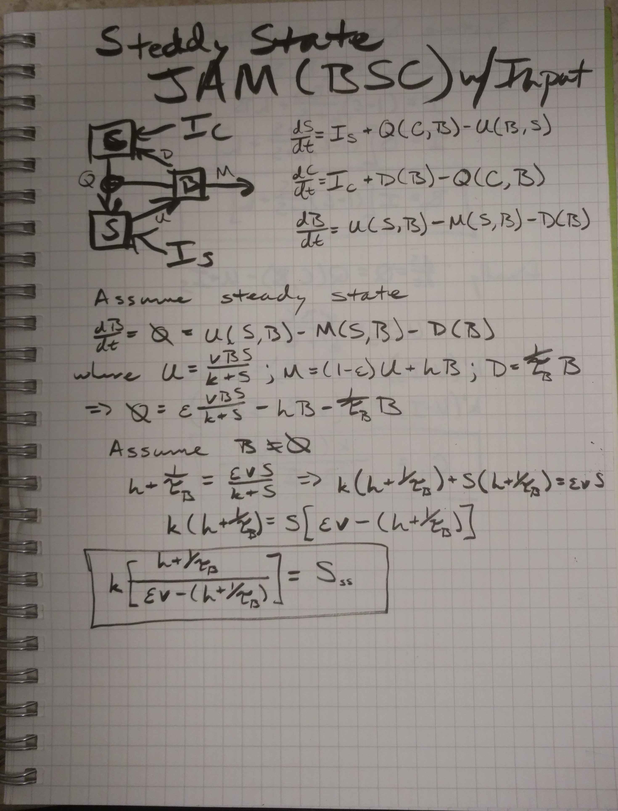
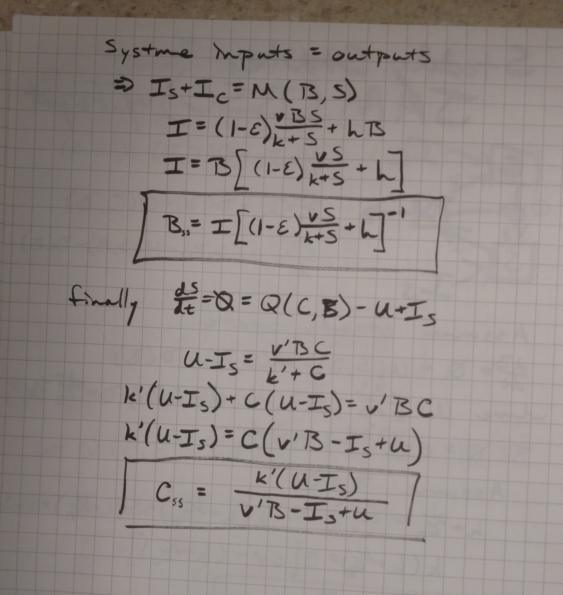

##Set up
```{r setup, message=FALSE}
library(assertthat)
library(reshape2)
library(ggplot2)
library(GGally)
library(plyr)
library(rootSolve)
library(deSolve)
library(knitr)
library(pander)
library(cowplot)

#sourceFiles <- 'R/invasion.R'
#l_ply(sourceFiles, source)

set.seed(100) #reproducible random selection

sessionInfo()
```

#Basic model description

```{r modelPic, out.width='30%', echo=FALSE}
library(knitr)


```

If we further assume that there is a trade off between both 1) uptake $v$ and carbon use effiency ($\epsilon$) such that $v=\frac{e^{b\epsilon_cue}-e^b}{1-e^b}$ and the half saturation constant ($k$) such that $k=a v +k_{min} = \frac{a}{1-e^b}(e^{b\epsilon_cue}-e^b)$. Defined as:

##Visualize trade-off between cue vs uptake and k
```{r tradeoff_cue_v}
cue_v_tradeoff <- function(b, vmax, cue){
  return(vmax*(exp(b*cue)-exp(b))/(exp(0)-exp(b)))
}

tradeoff.df <- adply(.data=c(-0.1*1:9, -1*1:10, 0.1*1:9, 1:10), .margins=c(1), .id=c('id'), .fun=function(b){
  ans <- data.frame(b=b, cue=seq(0, 1, length=1000))
  ans$v <- cue_v_tradeoff(b=b, vmax=2, cue=ans$cue)
  return(ans)
})

ggplot(tradeoff.df) + geom_line(aes(x=cue, y=v, group=b, color=b))

v_k_tradeoff <- function(kmin, k_v_slope, v){
  return(kmin+k_v_slope*v)
}

tradeoff.df$k <- v_k_tradeoff(kmin=0, k_v_slope=100/2, tradeoff.df$v) #slope is max SOC over vmax range
```

This leads to the following steady state calculations for one biomass pool:

```{r ssOneB}
steadyState <- function(b, vmax, kmin, k_v_slope, venz, kenz, h, m, Is, Ic, cue){
  v <- cue_v_tradeoff(b=b, vmax=vmax, cue)
  k <- v_k_tradeoff(kmin=kmin, k_v_slope=k_v_slope, v=v)
  
  S <- h*k/(cue*v-h)
  B <- (Is+Ic) / ( (1-cue)*v*S/(k+S)  + h )
  uptake <- v*S*B/(k+S)
  C <- kenz*(uptake-Is)/(venz*B-Is+uptake)
  return(list(B=B, S=S, C=C))
}
```

##Steady state sensitivity to inputs
How do inputs affect stead state?
```{r gradSSwI, cache=TRUE}
ssParm.ls <- list(b=c(-10, -1, 1, 10),
                vmax=c(0.1, 1, 10, 100),
                kmin=c(0, 1, 10, 100, 1000),
                k_v_slope=c(1/10, 1, 10, 100, 1000),
                venz=c(0.1, 1, 10, 100),
                kenz=c(0.1, 1, 10, 100),
                h=c(1e-4, 1e-3, 1e-2, 0.1, 1, 10),
                m=c(1e-4, 1e-3, 1e-2, 0.1, 1, 10),
                cue=c(0.2, 0.4, 0.6, 0.8),
                I=c(0.1, 1, 10),
                IcRel=c(0.1, 0.25, 0.5, 0.9))


steadyState.df <- expand.grid(ssParm.ls)
steadyState.df$Is <- with(steadyState.df, I*(1-IcRel))
steadyState.df$Ic <- with(steadyState.df, I*IcRel)

#Calculate the steady state values for each parameter combination
test <- with(steadyState.df, as.data.frame(steadyState(b, vmax, kmin, k_v_slope, 
                                                       venz, kenz, h, m, Is, Ic, cue)))
steadyState.df <- cbind(steadyState.df, test)

#Check to see if it's a reasonable value over any inputs
steadyState.df$OnTarget <- with(steadyState.df, B+C+S > 10 & B+C+S < 500 & 
                                  B/(B+C+S)> 0.001 & B/(B+C+S) < 0.15)
goodPars <- unique(subset(steadyState.df, OnTarget, select=c('b', 'vmax', 'kmin', 'k_v_slope', 'h', 'm', 'cue', 'IcRel', 'venz', 'kenz')))

ssGrad.df <- ldply(as.list(c(0.1, 1, 10)),
      function(xx){
        I <- xx
        ans1 <- with(goodPars, as.data.frame(steadyState(b, vmax, kmin, k_v_slope, 
                                                       venz, kenz, h, m, Is=I*(1-IcRel), 
                                           Ic=I*IcRel, cue)))
        
        I <- xx * rnorm(1, mean=1, sd=0.05)
        ans2 <- with(goodPars, as.data.frame(steadyState(b, vmax, kmin, k_v_slope, 
                                venz, kenz, h, m, Is=I*(1-IcRel), Ic=I*IcRel, cue)))
        
        ans1$I <- xx
        ans1$dB.dI <- (ans1$B-ans2$B)/(xx-I)
        ans1$dC.dI <- (ans1$C-ans2$C)/(xx-I)
        ans1$dS.dI <- (ans1$S-ans2$S)/(xx-I)
        return(cbind(goodPars, ans1))
      })


ssGrad.df$OnTarget <- with(ssGrad.df, B+C+S > 10 & B+C+S < 500 & 
                                  B/(B+C+S)> 0.001 & B/(B+C+S) < 0.15)

plot.df <- melt(subset(ssGrad.df, index %in% sample(unique(ssGrad.df$index), size=10),
                       select=c('index', 'I', 'B', 'C', 'S')), 
                id.vars=c('I', 'index'))
ggplot(plot.df) + geom_line(aes(x=I, y=value, color=as.factor(index))) +
  facet_wrap(~variable) +
  labs(title='Steady state carbon pool by inputs', x='Inputs', y='Pool size') +
  guides(color=FALSE)


plot.df <- melt(subset(ssGrad.df, OnTarget), 
                id.vars=c('B', 'C', 'dB.dI', 'dC.dI', 'dS.dI', 'OnTarget', 'index'))

ggplot(plot.df) + geom_boxplot(aes(x=as.factor(value), y=dB.dI)) +
  facet_wrap(~variable, scales='free') + 
  labs(title='dB/dI', x='Parameter value', y='Gradient (dB/dI)')
ggplot(plot.df) + geom_boxplot(aes(x=as.factor(value), y=dC.dI)) +
  facet_wrap(~variable, scales='free') + 
  labs(title='dC/dI', x='Parmaeter value', y='Gradient (dC/dI)')
ggplot(plot.df) + geom_boxplot(aes(x=as.factor(value), y=dS.dI)) +
  facet_wrap(~variable, scales='free') + 
  labs(title='dS/dI', x='Parmaeter value', y='Gradient (dS/dI)')
```

