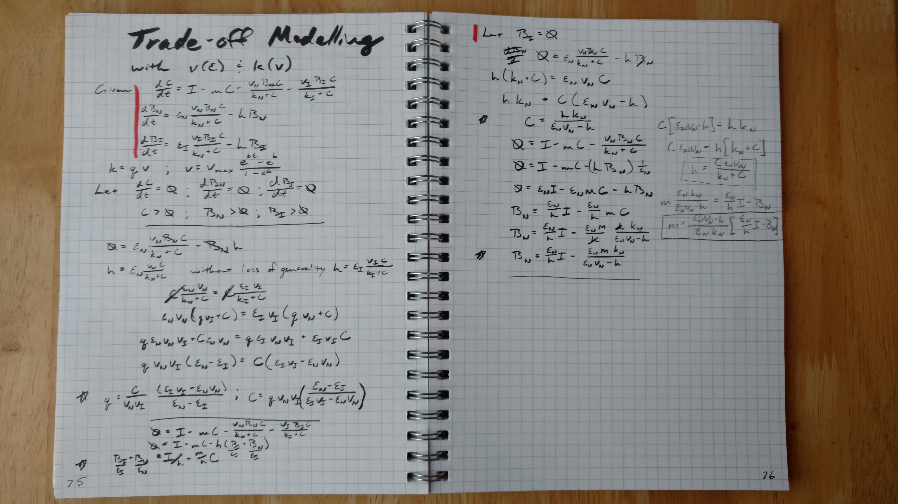

##Set up
```{r setup, message=FALSE}
library(assertthat)
library(reshape2)
library(ggplot2)
library(GGally)
library(plyr)
library(rootSolve)
library(deSolve)
library(knitr)
library(pander)
library(cowplot)

#sourceFiles <- 'R/invasion.R'
#l_ply(sourceFiles, source)

set.seed(100) #reproducible random selection

sessionInfo()
```

#Basic model description
The goal of this model to simulation biologically mediated decomposition. There are two main pools, Substrate ($C$) and Biomass ($B$). Carbon is added to the substrate pool via inputs ($I$), leached from both pools at a rate proportional to the carbon in the pool ($h$ fraction of the biomass pool $B$, and $m$ fraction of the substate pool $C$), and transfer between the substrate $C$ pool and biomass $B$ pool via a Monod uptake with a maximum rate $v$, half-saturation constant $k$, and carbon use effiency $\epsilon$.

$\frac{dB}{dt}=\frac{\epsilon vBC}{k+C}-hB$

$\frac{dC}{dt}=I-mC-\frac{vBC}{k+C}$

At steady state ($\frac{dB}{dt}=\frac{dC}{dt}=0$) this implies that:

$B=\frac{\epsilon}{h}(I-mC)$

$C=\frac{hk}{\epsilon v-h}$

```{r modelPic, out.width='30%', echo=FALSE}
#library(knitr)
#include_graphics('notes/2016September_meeting.jpg')
```

If we further assume that there is a trade off between both 1) uptake $v$ and carbon use effiency ($\epsilon$) such that 
$v=\frac{e^{b\epsilon}-e^b}{1-e^b}$ 

and the half saturation constant ($k$) such that $k=a v +k_{min} = \frac{a}{1-e^b}(e^{b\epsilon}-e^b)$.

```{r tradeoff_cue_v}
cue_v_tradeoff <- function(b, vmax, cue){
  return(vmax*(exp(b*cue)-exp(b))/(exp(0)-exp(b)))
}

v_k_tradeoff <- function(kmin, a, v){
  return(kmin+a*v)
}
```

This leads to the following steady state calculations for one biomass pool:

```{r ssOneB}
steadyState <- function(b, vmax, kmin, a, h, m, I, cue){
  v <- cue_v_tradeoff(b=b, vmax=vmax, cue)
  k <- v_k_tradeoff(kmin=kmin, a=a, v=v)
  
  C <- h*k/(cue*v-h)
  B <- cue/h*(I-m*C)
  return(list(B=B, C=C))
}
```

##Plot tradeoffs
```{r plotTrades}

tradeoff.df <- adply(.data=c(-0.1*1:9, -1*1:10, 0.1*1:9, 1:10), .margins=c(1), .id=c('id'), .fun=function(b){
  ans <- data.frame(b=b, cue=seq(0, 1, length=1000))
  ans$v <- cue_v_tradeoff(b=b, vmax=2, cue=ans$cue)
  return(ans)
})


tradeoff.df$k <- v_k_tradeoff(kmin=0, a=100/2, tradeoff.df$v) #slope is max SOC over vmax range

ggplot(tradeoff.df) + geom_line(aes(x=cue, y=v, group=b, color=b))

```

##Steady state sensitivity to inputs
How do inputs affect stead state?

Given that at steady state we know:
$B=\frac{\epsilon}{h}(I-mC)$

$C=\frac{hk}{\epsilon v-h}$

$C$ is instenstive to changes in inputs and $\frac{dB}{dI} = \frac{\epsilon}{h}$.

#Optimum carbon use effiency
We want the optimum carbon use effiency where biomass is maximum as steady state but that is not possible to solve analytically (you end up with $y=xe^x$, solve for x). 
We instead bruite force a solution, iterating $\epsilon$ over $[0,1]$ in incraments of $0.01$

```{r findOptCUE}
optimum_cue <- function(b, vmax, kmin, a, h, m, I){
  cue <- seq(0, 1, length=100)
  ans <- steadyState(b, vmax, kmin, a, h, m, I, cue)
  ans$B[ans$B <= 0 | ans$C <= 0] <- -Inf
  ans$C[ans$B <= 0 | ans$C <= 0] <- -Inf
  
  best <- which.max(ans$B)
  return(list(B_opt=ans$B[best], C_opt=ans$C[best], cue_opt=cue[best]))
}
```

##Generate reasonable parameter sets without compitition
Given that we have input targets between 0.1 and 10 mg-C per g-soil per day, total carbon pools of between 10 to 500 mg-C per g-soil, and a biomass to total carbon ratio of between 0.1 and 15 percent. Let's generate some reasonable parameters to draw on.

```{r resonable, cache=TRUE}
parm.ls <- list(b=c(-10, -1, -0.1, 0.1, 1, 10),
                vmax=c(0.1, 0.5, 1, 5, 10, 100),
                kmin=c(0, 1, 10, 100, 1000),
                a=c(1/10, 1, 10, 100, 1000),
                h=c(1e-4, 1e-3, 1e-2, 0.1, 1, 10),
                m=c(1e-4, 1e-3, 1e-2, 0.1, 1, 10),
                I=c(0.1, 1, 10))
                
parm.df <- expand.grid(parm.ls)

parm.df <- ddply(parm.df, names(parm.df), function(xx){
  ans <- as.data.frame(optimum_cue(b=xx$b, vmax=xx$vmax, kmin=xx$kmin, a=xx$a, 
              h=xx$h, m=xx$m, I=xx$I))
  return(ans)
})

parm.df$validPools_opt <- with(parm.df, B_opt+C_opt > 10 & B_opt+C_opt < 500 & 
                                 B_opt/(B_opt+C_opt)> 0.001 & B_opt/(B_opt+C_opt) < 0.15)

ggplot(subset(parm.df, validPools_opt)) + geom_histogram(aes(x=cue_opt))
ggplot(subset(parm.df, validPools_opt)) + geom_violin(aes(x=as.factor(I), y=cue_opt)) 

```

#Competition model co-existance
Consider the senerio where the native popuation is invated by a second competiting population that has a different carbon use effiency but is otherwise equivalent.
Let the strategic carbon use effiency be where the native popuation is never invadable no matter what carbon use effiency value the invader has.

```{r coExPic, out.width='60%', echo=FALSE}
#library(knitr)
#
```

$\frac{dB_i}{dt}=\frac{\epsilon_i v_iB_iC}{k_i+C}-hB_i$
$\frac{dB_n}{dt}=\frac{\epsilon_n v_nB_nC}{k_n+C}-hB_n$
$\frac{dC}{dt}=I-mC-\frac{v_iB_iC}{k_i+C}-\frac{v_nB_nC}{k_n+C}$

where $n$ and $i$ stand for the native and invading populations respectively.

At steady state ($\frac{dB_i}{dt}=\frac{dB_n}{dt}=\frac{dC}{dt}=0$) this implies that:

Both populations are stable where biomass is either 0 or
$h=\frac{\epsilon_n v_n}{k_n + C} = \frac{\epsilon_i v_i}{k_i + C}$

And further that:
$\frac{B_i}{\epsilon_i} + \frac{B_n}{\epsilon_n}=\frac{I-mC}{h}$

$C=\frac{hk_i}{\epsilon_i v_i-h} = \frac{hk_n}{\epsilon_n v_n-h}$

We want $n$ where for all $i$, $B_i = 0$ and $B_n > 0$. 
That is, where the nature species $B_n$ resists all invaders $B_i$.

First consider the case where both populations are positive at steady state, $B_n > 0$ and $B_i > 0$ and the two populations have distinct cue, $\epsilon_i \neq \epsilon_n$.
$\frac{\epsilon_n v_n}{k_n + C} = \frac{\epsilon_i v_i}{k_i + C}$

Alernatively $C$ is a constant, this implies that:
$\frac{k_i}{\epsilon_i v_i-h} = \frac{k_n}{\epsilon_n v_n-h}$

Admittedly a bear of a function to visualize so here's help:
```{r, coexistancePlot}  

ans <- with(subset(parm.df, validPools_opt)[1,],{
  cue <- seq(0, 1, length=100)
  v <- cue_v_tradeoff(b=b, vmax=vmax, cue);
  k <- v_k_tradeoff(kmin=kmin, a=a, v=v);
  data.frame(steadyState(b, vmax, kmin, a, h, m, I, cue),
             v=v, k=k, h=h, cue=cue)
})
  
ggplot(subset(ans, B > 0 & C > 0)) + 
  geom_line(aes(cue, y=(cue*v)/(k+C))) +
  geom_point(aes(cue, (cue*v-h)/k))
  
ggplot(subset(ans, (cue*v-h)/k > 0)) + geom_line(aes(cue, (cue*v-h)/k))
```


Thus there are two CUE with distinct steady state biomasses which satify the relation
$\frac{\epsilon_n v_n}{k_n + C} = \frac{\epsilon_i v_i}{k_i + C}$
except at the maximum of
$u_1(\epsilon)=\frac{\epsilon v}{k + C(\epsilon)}$
or
$u_2(\epsilon)=\frac{\epsilon v-h}{k}$

The first form of this equilvancey maximizes growth rate and is equilvanent to Tillman's R* strategy.

## Generate strategic CUE
```{r findStrategic, cache=TRUE}
strategic_cueI <- function(b, vmax, kmin, a, m, h, I){
  cue <- seq(0, 1, length=100)
  v <- cue_v_tradeoff(b=b, vmax=vmax, cue)
  k <- v_k_tradeoff(kmin=kmin, a=a, v=v)
  
  ans <- steadyState(b, vmax, kmin, a, h, m, I, cue)
  
  measure <- cue*v/(k+ans$C)
  measure[measure <= 0] <- NA
  flag <- which.max(measure)
  
  return(list(cue_strat=cue[flag], C_strat=ans$C[flag], B_strat=ans$B[flag]))
}

parm.df <- ddply(parm.df, names(parm.df), function(xx){
  return(as.data.frame(strategic_cueI(b=xx$b, vmax=xx$vmax, 
                                      kmin=xx$kmin, a=xx$a, m=xx$m, 
                                      h=xx$h, I=xx$I)))
})

parm.df$validPools_strat <- with(parm.df, B_strat+C_strat > 10 & 
                                        B_strat+C_strat < 500 & 
                                        B_strat/(B_strat+C_strat)> 0.001 & 
                                        B_strat/(B_strat+C_strat) < 0.15)

ggplot(subset(parm.df, validPools_opt & validPools_strat)) + 
  geom_point(aes(x=cue_opt, y=cue_strat)) + 
  geom_abline(slope=1, intercept=c(0), color='grey') +
  labs(x='Optimum CUE (max B w/o compition)', y='Strategic CUE (resistant to invasion)')

```

#Explore drivers of strategic and optimum differences
```{r exploreDifference}
diff.df <- subset(parm.df, validPools_opt & validPools_strat)

diff.df <- melt(diff.df, measure.vars=names(parm.ls))

ggplot(diff.df) + geom_violin(aes(x=as.factor(value), y=(cue_opt-cue_strat)/cue_opt)) + 
    facet_wrap(~variable, scale='free')
```

We are particullary interested in differences in inputs
```{r exploreInput, cache=TRUE}
validParms <- unique(subset(parm.df, validPools_strat & validPools_opt, 
                     select=c("b", "vmax", "kmin", "a", "h", "m")))
I.arr <- seq(0.1, 10, by=0.3)
Igrad <- ddply(validParms, c("b", "vmax", "kmin", "a", "h", "m"), function(xx){
      ans1 <- ddply(data.frame(xx, I=I.arr), c('I'), function(yy){
        with(data=yy, data.frame(optimum_cue(b, vmax, kmin, a, h, m, I),
                                    strategic_cueI(b, vmax, kmin, a, h, m, I)))
      })
      ans2 <- ddply(data.frame(xx, I=I.arr*rnorm(length(I.arr), mean=1, sd=0.05)), 
                    c('I'), function(yy){
        with(data=yy, data.frame(optimum_cue(b, vmax, kmin, a, h, m, I),
                                    strategic_cueI(b, vmax, kmin, a, h, m, I)))
                    })
      #cat('dim ans2:', dim(ans1), '\n')
      if(nrow(ans1) != nrow(ans2)){
        print(xx[c("b", "vmax", "kmin", "a", "h", "m"),])
        return(NULL)
      }
      
      dvar <- ans1-ans2
      names(dvar) <- sprintf('d%s', names(dvar))
      
      return(cbind(ans1, dvar))
})
Igrad$validParam <- with(Igrad, B_opt+C_opt > 10 & 
                           B_opt+C_opt < 500 & 
                           B_opt/(B_opt+C_opt)> 0.001 & 
                           B_opt/(B_opt+C_opt) < 0.15 &
                           B_strat+C_strat > 10 & 
                           B_strat+C_strat < 500 & 
                           B_strat/(B_strat+C_strat)> 0.001 & 
                           B_strat/(B_strat+C_strat) < 0.15)
```

```{r plotIgrad}
plot.df <- melt(Igrad, measure.vars=names(Igrad)[grepl('_(opt)|(strat)', names(Igrad))])
temp <- as.data.frame(matrix(unlist(strsplit(as.character(plot.df$variable), '_|\\.')), ncol=2, byrow=TRUE))
names(temp) <- c('variable', 'type')
plot.df$variable <- NULL
plot.df <- cbind(plot.df, temp)
plot.df$isGrad <- grepl('d', as.character(plot.df$variable))

ggplot(subset(plot.df, validParam & isGrad)) + geom_hex(aes(x=I, y=value/dI)) + facet_grid(variable~type, scales='free')

ggplot(subset(plot.df, validParam & !isGrad)) + geom_hex(aes(x=I, y=value)) + facet_grid(variable~type, scales='free')
```

#Numerical validation code

Let's pick some points where the gap between the Optimum CUE and Strategic CUE is small ($<20$ percent) and large ($>20$ percent).
```{r pickNumerical}
bigGap.df <- subset(parm.df, validPools_opt & validPools_strat & abs(cue_strat-cue_opt) > 0.2)
smallGap.df <- subset(parm.df, validPools_opt & validPools_strat & abs(cue_strat-cue_opt) < 0.2)

numParm.df <- rbind.fill(bigGap.df[sample.int(nrow(bigGap.df), size=2),],
                         smallGap.df[sample.int(nrow(smallGap.df), size=2),])
numParm.df$index <- 1:nrow(numParm.df)
pander(numParm.df[,c(names(parm.ls), c('cue_opt','C_opt', 'B_opt', 'cue_strat','C_strat', 'B_strat'))])
```

##Validate optimium CUE

```{r validateOpt}
opt.validate <- ddply(numParm.df, c('index', 'C_opt', 'B_opt'), function(xx){
  cue <- seq(0, 1, length=100)
  ans <- steadyState(xx$b, xx$vmax, xx$kmin, xx$a, xx$h, xx$m, xx$I, cue)
  return(data.frame(cue=cue, C=ans$C, B=ans$B))
})

plot.df <- melt(subset(opt.validate, B>0 & C>0), measure.vars=c('C', 'B'))
ggplot(plot.df) + geom_line(aes(x=cue, y=value, group=index)) + 
  geom_vline(data=numParm.df, aes(xintercept=cue_opt)) + 
  facet_grid(variable~index, scales='free')

```

##Validate strategic CUE
```{r validateStrat, warning=FALSE, message=FALSE, results='hide'}

compitition.model <- function(t, y, parms){
  C <- y[1]; Bn <- y[2]; Bi <- y[3]

  ans <- with(parms,
              c(dC = I - m*C - C*(vn*Bn/(kn+C) + vi*Bi/(ki+C)),
                   dBn = cuen*vn*Bn*C/(kn+C) - hn*Bn,
                   dBi = cuei*vi*Bi*C/(ki+C) - hi*Bi)
       )
  return(list(ans))
}

runInvasions <- ddply(numParm.df, c('index'), function(xx){
  
  parm <- as.list(xx[, c('b', 'vmax', 'kmin', 'a', 'm', 'I')])
  
  parm$hn <- xx$h
  parm$hi <- xx$h
  
  cueCombo <- expand.grid(cuen=seq(1, 100, length=50)/100,
                          rel_cuei=rnorm(10, sd=0.1))
  cueCombo$cuei <- cueCombo$cuen+rnorm(nrow(cueCombo), sd=0.1)
  cueCombo <- cueCombo[cueCombo$cuei > 0,]
  
  cueCombo$vn <- with(parm, cue_v_tradeoff(b=b, vmax=vmax, cueCombo$cuen))
  cueCombo$kn <- with(parm, v_k_tradeoff(kmin=kmin, a=a, v=cueCombo$vn))
  
  cueCombo$vi <- with(parm, cue_v_tradeoff(b=b, vmax=vmax, cueCombo$cuei))
  cueCombo$ki <- with(parm, v_k_tradeoff(kmin=kmin, a=a, v=cueCombo$vi))
  
  invade.df <- ddply(cueCombo, c('cuen', 'cuei'), function(cuePairs){
    comboParm <- c(parm, cuePairs)
    preInvade <- with(comboParm, steadyState(b, vmax, kmin, a, h=hn, m, I, cue=cuen))
    if(all(preInvade > 0)){
      y0 <- list(C=preInvade$C, Bn=preInvade$B, Bi=preInvade$B*0.1)
      invasion <- lsoda(y=unlist(y0), times=c(1, 7, 30, 365, 365*10), func=compitition.model, parms=comboParm)
      names(y0) <- paste(names(y0), '0', sep='')
      if(nrow(invasion) == 5){
        finalPools <- as.data.frame(c(comboParm, y0, as.list(invasion[nrow(invasion),])))
      }else{
        finalPools <- as.data.frame(comboParm)
      }
    }else{
      finalPools <- as.data.frame(comboParm)
    }
  })
  
  return(invade.df)
})
```
```{r plotValid}
ggplot(runInvasions) + geom_point(aes(x=cuen, y=cuei, color=Bn > Bi)) + 
  geom_vline(data=numParm.df, aes(xintercept=cue_strat)) + 
  labs(x='Native CUE', y='Invader CUE', title='Winner of 10 year invasion') +
  facet_wrap(~index)
```
